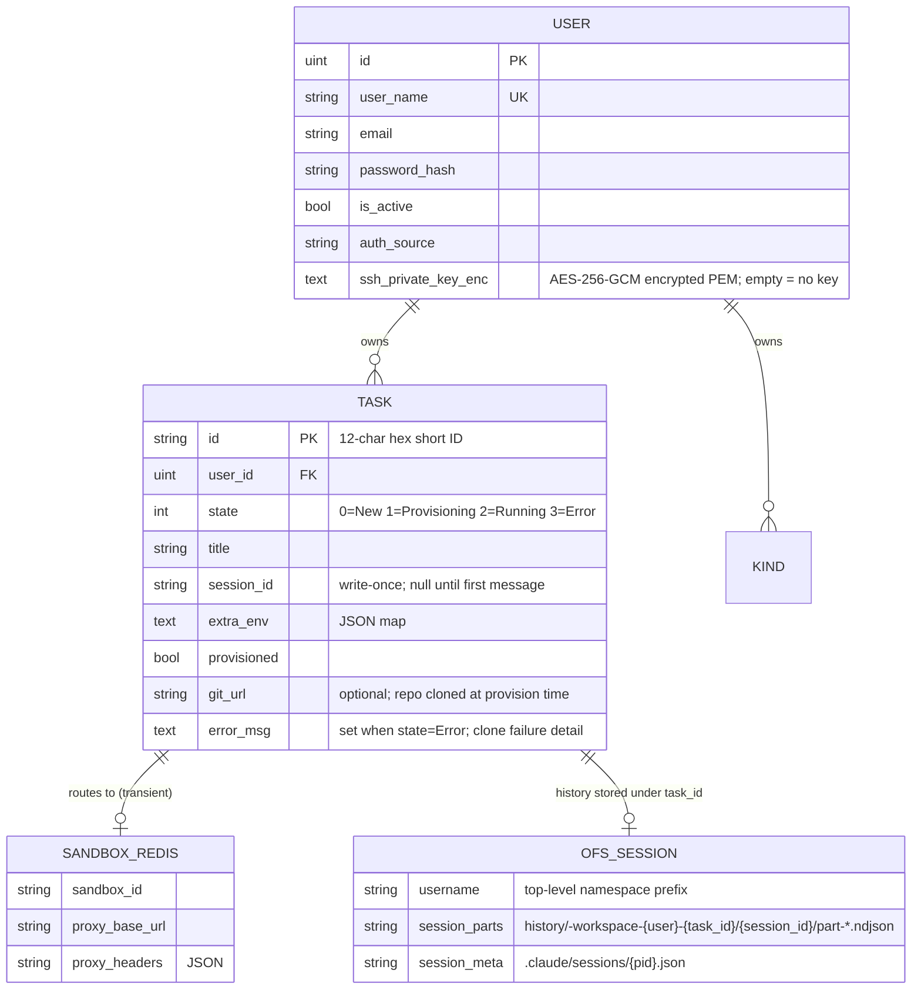

# Data Management: User, Task, and Sandbox

## Overview

Three principal entities form the backend data model. Their storage, lifetimes, and relationships are intentionally decoupled to allow sandboxes to be destroyed and recreated without losing conversation state.

| Entity | Identity | Lifetime | Primary Store |
|--------|----------|----------|---------------|
| **User** | `user.id` (uint, auto-increment) | Permanent | MySQL `users` |
| **Task** | `task_id` (12-char hex) | Permanent | MySQL `tasks` + Redis |
| **Sandbox** | `sandbox_id` (OpenSandbox string) | Ephemeral | Redis `sandbox:{task_id}` |
| **Resource** | `kind.id` (int, auto-increment) | Permanent | MySQL `kinds` + OFS S3 |

---

## Entity Relationship Diagram



Where `KIND` is:

```
KIND {
    int    id           PK
    uint   user_id      FK
    string kind             "skill | mcp"
    string name
    string ofs_path         "S3 key prefix (skill) or full key (mcp)"
    json   meta             "MCP config; {} for skills"
    bool   is_active
}
```

---

## Storage Split

```
┌───────────────────────────────────────────────────────────────────────────┐
│  MySQL  (durable)                                                          │
│  ─────────────────────────────────────────────────────────────────────    │
│  users:  id │ user_name │ email │ password_hash │ is_active │ auth_source  │
│             │ ssh_private_key_enc (TEXT, AES-256-GCM encrypted PEM or '')  │
│  tasks:  id │ user_id(FK) │ state │ title │ session_id │ extra_env │       │
│             │ provisioned │ git_url (VARCHAR 512, nullable) │ error_msg     │
│             │ (TEXT, nullable) │ created_at │ updated_at                   │
│  kinds:  id │ user_id(FK) │ kind │ name │ ofs_path │ meta(JSON) │          │
│             │ is_active │ created_at │ updated_at                          │
│             │ UNIQUE(user_id, kind, name)                                  │
└───────────────────────────────────────────────────────────────────────────┘

┌─────────────────────────────────────────────────────────┐
│  Redis  (ephemeral)                                      │
│  ────────────────────────────────────────────────────── │
│  sandbox:{task_id}  hash                                 │
│    sandbox_id      ← OpenSandbox container ID           │
│    proxy_base_url  ← routing URL to sandbox agent       │
│    proxy_headers   ← JSON auth headers                  │
│    TTL: 7 days                                          │
│                                                          │
│  task-lock:{task_id}  string                             │
│    value: {hostname}:{pid}                               │
│    TTL: 30 seconds (provisioning lock)                   │
└─────────────────────────────────────────────────────────┘

┌──────────────────────────────────────────────────────────────────────────┐
│  OFS / S3  (session history — written by agent server, read by backend)  │
│  ──────────────────────────────────────────────────────────────────────  │
│  {username}/history/-workspace-{username}-{task_id}/{session_id}/        │
│              └── part-{13ms}-{rand}.ndjson  ← conversation NDJSON parts  │
│  {username}/.claude/sessions/{pid}.json     ← agent process record       │
│                                                                           │
│  OFS / FUSE  (workspace files — mounted inside sandbox only)             │
│  ──────────────────────────────────────────────────────────────────────  │
│  /workspace/{username}/{task_id}/  ← agent project files (not S3-read)  │
└──────────────────────────────────────────────────────────────────────────┘
```

---

## Relationships

### User → Task

- **Cardinality:** one-to-many (`user.id` → `task.user_id`)
- **Constraint:** `ON DELETE CASCADE` — deleting a user removes all their tasks
- **Join key at API layer:** `username` string (tasks are created and listed by username; the repository resolves to `user_id` internally)

### User → Kind

- **Cardinality:** one-to-many (`user.id` → `kinds.user_id`)
- **Constraint:** `ON DELETE CASCADE` — deleting a user removes all their resource records
- **Uniqueness:** `UNIQUE(user_id, kind, name)` — a user cannot register the same name twice for the same kind
- **OFS content:** not deleted when the DB record is deleted (OFS cleanup is out of scope)

### Task → Sandbox

- **Cardinality:** one-to-zero-or-one *at any point in time*; one-to-many *over the task's lifetime*
- **Binding:** `sandbox_id` lives in Redis under `sandbox:{task_id}`, not in MySQL. It is absent when no sandbox is running.
- **Stability:** `task_id` is injected into every sandbox as `TASK_ID`. The OFS FUSE mount uses it as the workspace subpath (`{username}/workspaces/{task_id}`) so workspace files survive sandbox recreation.

### Task → Session

- **Cardinality:** one-to-zero-or-one
- **Binding:** `session_id` (Claude Code UUID) is written once to `tasks.session_id` on the first `session.init` SSE event. It is **never cleared**.
- **Purpose:** allows the backend to read conversation history from OFS even when no sandbox is active.

---

## Task State Machine

The API-visible state is derived from two independent fields: `state` (sandbox liveness) and whether `session_id` is set (conversation history exists).

```
                         session_id empty           session_id set
                         ─────────────────────────────────────────
  StateNew        (0)  → "pending"                  "paused"
  StateProvisioning(1) → "provisioning"             "resuming"
  StateRunning    (2)  → "idle"                     "active"
  StateError      (3)  → "error"                    "error"
```

State transitions:

```
                   ┌──────────────────────────────────────────────────────┐
                   │                                                        │
  [task created]   │   [provision]          [sandbox ready]                │
  ┌─────────┐      │  ┌──────────────┐     ┌─────────┐                    │
  │  New(0) │──────┴─▶│Provisioning(1)│────▶│Running(2)│                   │
  └─────────┘         └──────────────┘     └─────────┘                    │
       ▲                     │                   │                          │
       │                     │ error             │ sandbox expires/deleted  │
       │                     ▼                   │                          │
       │              ┌─────────────┐            │ [ResetIfExpired]         │
       │              │  Error(3)   │            └─────────────────────────┘
       │              └─────────────┘
       │
       └── session_id is retained across all transitions
```

---

## Data Lifecycle

### Create Task

1. Resolve `username` → `user_id` in MySQL
2. `INSERT INTO tasks` (state=0, provisioned=false, session_id='', git_url=?, error_msg='')
3. No Redis writes

### Send First Message (triggers sandbox provisioning)

1. `SELECT * FROM tasks` + `HGETALL sandbox:{id}` (empty)
2. Acquire `task-lock:{id}` (Redis, 30 s TTL)
3. Check `tasks.provisioned` — false → run provisioning
4. Create sandbox → health-check passes → inject SSH key → inject resources
5. If `git_url != ""`: run `git clone <git_url> .` via execd command API  
   On failure: `UPDATE tasks SET state=3, error_msg=<stderr>` → abort provisioning
6. `SetRunning`: `UPDATE tasks SET state=2` + `HSET sandbox:{id} ...` (7-day TTL)
7. Verify MySQL state=2 and Redis sandbox_id non-empty
8. `UPDATE tasks SET provisioned=true`
9. Release lock; proxy message to sandbox
10. On SSE `session.init`: `UPDATE tasks SET session_id=? WHERE session_id=''` (write-once)
11. On stream complete: read session title → `UPDATE tasks SET title=?`

### Sandbox Expires, New Message Arrives

1. `ResetIfExpired`: acquire lock → check `sandbox_id` liveness → not alive
2. `UPDATE tasks SET state=0, provisioned=false` + `DEL sandbox:{id}`
3. `EnsureProvisioned`: create new sandbox → new `sandbox_id` in Redis
4. `session_id` in MySQL is **unchanged** — conversation resumes from OFS history

### Delete Task

```sql
DELETE FROM tasks WHERE id = ?
```
```
DEL sandbox:{task_id} task-lock:{task_id}   -- best-effort Redis cleanup
```

User data in OFS (`{username}/history/...` and `{username}/.claude/...`) is **not** deleted by the backend at task delete time.

---

## Key Invariants

| # | Invariant |
|---|-----------|
| 1 | `task_id` is the only stable identifier across sandbox recreations |
| 2 | `sandbox_id` is transient — never used as a durable session key |
| 3 | `session_id` is null at task creation; backend must handle this |
| 4 | `session_id` is **never cleared** once written; history is always readable via OFS |
| 5 | `provisioned=true` is set only after both MySQL state=2 and Redis sandbox hash are verified |
| 6 | `user_id` is immutable once assigned; tasks belong to exactly one user |

---

## Related Documents

- [`storage.md`](storage.md) — MySQL + Redis schema and operation sequences
- [`resource-mapping.md`](resource-mapping.md) — Task / Sandbox / Session lifecycle and state table
- [`ofsspec.md`](ofsspec.md) — OFS file layout and session history structure
- [`resources.md`](resources.md) — User resources (skills/MCP): API, DB schema, OFS paths, sandbox injection
- [`ssh-key-management.md`](ssh-key-management.md) — Per-user SSH key: encryption, API, sandbox injection
- [`git-task-integration.md`](git-task-integration.md) — Optional git repository cloning at provision time (`git_url`, `error_msg`)
